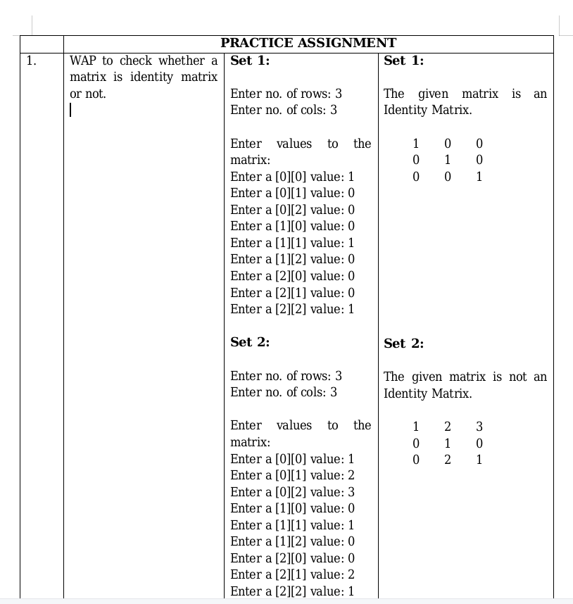

## Lab 12

-  **p12.1.c** : WAP to check whether a matrix is identity matrix or not.
-  **p12.2.c** : WAP to find out the frequency of even and odd numbers in a matrix. 
-  **p12.3.c** : WAP to find the transpose of a matrix.
-  **p12.4.c** : WAP to find the Trace (sum of the diagonal elements) of a given m xn matrix.

