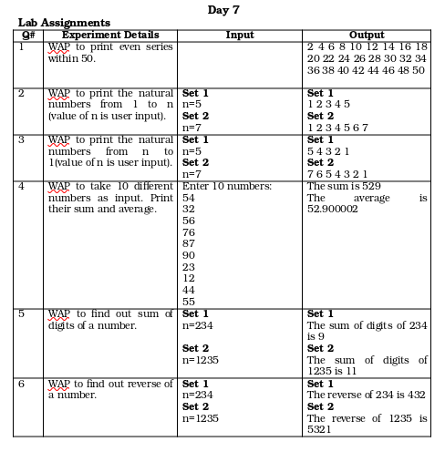

## Lab 8

*p8.1.c* : Grace Marks calculator
*p8.2.c* : WAP to print the natural numbers from 1 to n (value of n is user input).
*p8.3.c* : WAP to print the natural numbers from n to 1(value of n is user input).
*p8.4.c* : WAP to take 10 different numbers as input. Print their sum and average.
*p8.5.c* : WAP to find out sum of digits of a number.
*p8.6.c* : WAP to find out reverse of a number.

