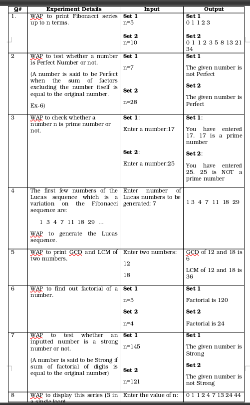

## Lab 9

-  **p9.1.c** : WAP to swap first and last digits of number.

-  **p9.2.c** : WAP to find the frequency of each digit in a given number.

-  **p9.3.c** : WAP to print fibonnchci series upto n terms

-  **p9.4.c** : WAP to find ones compliment of a binary number.

